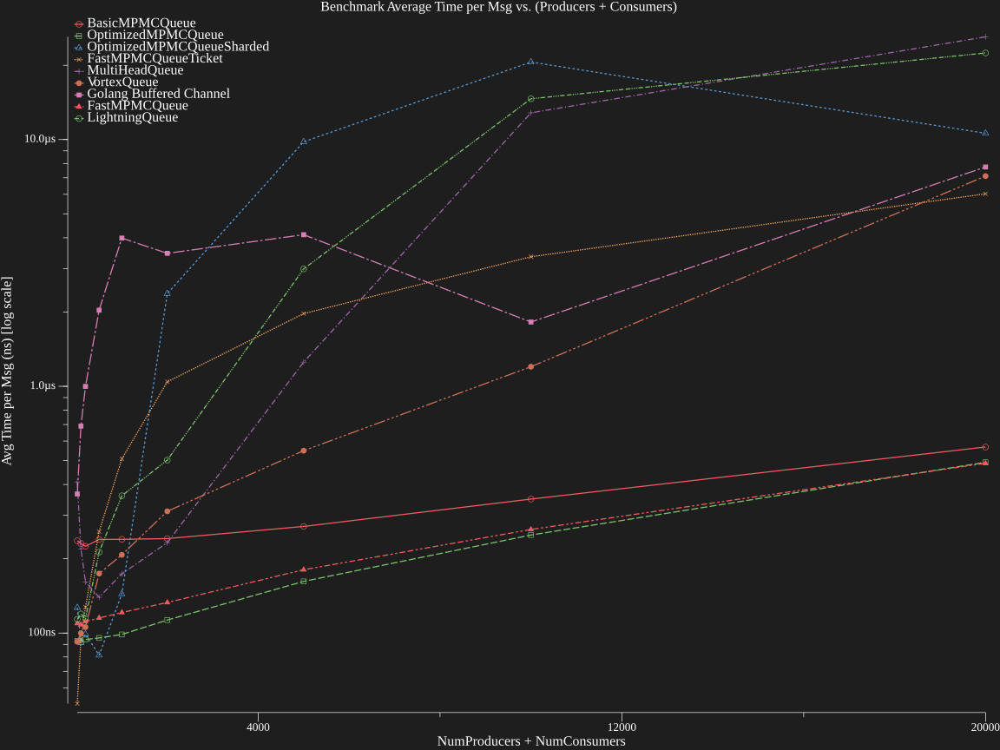

# GoQueueBench - Finding the Fastest Golang Queue

Welcome to **GoQueueBench**, a project dedicated to benchmarking and evaluating the fastest Golang queue implementations.

## Benchmark Summary

## Overall Summary
| Implementation           | Overall Score | GeoMean Baseline (Light Load) | GeoMean Worst-case (Heavy Load) | Stability Ratio | Core Consistency | Uncertainty | Total Tests |
|--------------------------|---------------|-------------------------------|---------------------------------|-----------------|------------------|-------------|-------------|
| OptimizedMPMCQueue       | **411064.20** | 12912103                      | 2552299                         | 0.20            | 0.36             | 0.42        | 45          |
| FastMPMCQueue            | 249224.56     | 11903141                      | **2617276**                     | 0.22            | 0.20             | 0.38        | 45          |
| BasicMPMCQueue           | 180185.96     | 5517519                       | 2247495                         | **0.41**        | 0.13             | **0.36**    | 45          |
| FastMPMCQueueTicket      | 21814.19      | **20931910**                  | 235224                          | 0.01            | **0.87**         | 1.37        | 45          |
| Golang Buffered Channel  | 9594.27       | 2022529                       | 77994                           | 0.04            | 0.63             | 1.78        | 45          |
| VortexQueue              | 295.16        | 7111857                       | 28960                           | 0.00            | 0.16             | 1.96        | 45          |
| OptimizedMPMCQueueSharded | 152.70        | 8840763                       | 20102                           | 0.00            | 0.16             | 1.74        | 45          |
| MultiHeadQueue           | 144.88        | 3019190                       | 16814                           | 0.01            | 0.12             | 1.60        | 45          |
| LightningQueue           | 95.00         | 3982777                       | 12856                           | 0.00            | 0.13             | 1.67        | 45          |

## Local Scores by Cores Group
| Implementation           | Score 2Cores | Score 8Cores | Score 32Cores |
|--------------------------|------------|------------|------------|
| BasicMPMCQueue           | 9127055 | 2729517 | 1752860 |
| FastMPMCQueue            | **11901231** | 4330046 | 3374289 |
| FastMPMCQueueTicket      | 3851630 | 1790242 | 1584453 |
| Golang Buffered Channel  | 172058 | 594066 | 612948 |
| LightningQueue           | 7723 | 626370 | 2395075 |
| MultiHeadQueue           | 7489 | 305996 | 4991502 |
| OptimizedMPMCQueue       | 9645956 | **4673683** | 4196510 |
| OptimizedMPMCQueueSharded | 15363 | 618628 | **7882916** |
| VortexQueue              | 13457 | 1235016 | 5624004 |


<details>
<summary><span style="font-weight:bold;"> 🚀 Click for the score formulas </span></summary>

$$
\text{Overall Score} = \sqrt{\text{GeoMean(Baseline Throughput)} \times \text{GeoMean(Worst-case Throughput)}} \times \text{GeoMean(Stability Ratio)} \times \text{Core Consistency}
$$  

$$
\text{Local Score} = \sqrt{\text{Baseline Throughput (Top 5\% Avg)} \times \text{Worst-case Throughput (Bottom 5\% Avg)}}
$$
- **Baseline Throughput (Light Load):** Average throughput of the top 5% tests (lowest total concurrency)
- **Worst-case Throughput (Heavy Load):** Average throughput of the bottom 5% tests (lowest throughput)
- **Stability Ratio:** `(Worst-case Throughput) / (Baseline Throughput)`  
- **Core Consistency:** `(Minimum Baseline Throughput) / (Maximum Baseline Throughput)` across cores groups
- **Uncertainty:** Maximum relative standard deviation over all tests in each cores group


</details>  
<br />

| vCPU   | Normal Concurrency Benchmark                                             | High Concurrency Benchmark                                       |
|--------|--------------------------------------------------------------------------|------------------------------------------------------------------|
| 2vCPU  |   |   |
| 16vCPU |  |  |
| 32vCPU |  |  |

<details>
<summary><span style="font-weight:bold;"> 🚀 Benchmark Results (click to expand)</span></summary>

### 2vCPU  (sorted by Avg Time per Msg in ns)

#### High Concurrency

| Implementation            | Package         | Features                                       | Author                                                                                                    | Avg Time per Msg (ns) |
|---------------------------|-----------------|------------------------------------------------|-----------------------------------------------------------------------------------------------------------|-----------------------|
| FastMPMCQueue             | fastmpmc        | MPMC, FIFO, Cache-Optimized                    | [Mia Heidenstedt](https://heidenstedt.org), OpenAI o3-mini-high[*](#why-are-there-llms-listed-as-authors) | 212                   |
| BasicMPMCQueue            | basicmpmc       | MPMC, FIFO                                     | [Mia Heidenstedt](https://heidenstedt.org), OpenAI o3-mini-high[*](#why-are-there-llms-listed-as-authors) | 213                   |
| OptimizedMPMCQueue        | optmpmc         | MPMC, FIFO                                     | [Mia Heidenstedt](https://heidenstedt.org), OpenAI o1[*](#why-are-there-llms-listed-as-authors)           | 252                   |
| FastMPMCQueueTicket       | fastmpmc_ticket | MPMC, FIFO, Cache-Optimized, Ticket-Based      | [Mia Heidenstedt](https://heidenstedt.org), OpenAI o3-mini-high[*](#why-are-there-llms-listed-as-authors) | 1449                  |
| Golang Buffered Channel   | buffered        | MPMC, FIFO                                     | [Mia Heidenstedt](https://heidenstedt.org)                                                                | 13354                 |
| VortexQueue               | vortexqueue     | MPMC, FIFO, Cache-Optimized, Spin-Wait         | [Mia Heidenstedt](https://heidenstedt.org), OpenAI o3-mini-high[*](#why-are-there-llms-listed-as-authors) | 12708919              |
| OptimizedMPMCQueueSharded | optmpmc_sharded | MPMC, Sharded, Multi-Head-FIFO                 | [Mia Heidenstedt](https://heidenstedt.org), OpenAI o1[*](#why-are-there-llms-listed-as-authors)           | 15826009              |
| LightningQueue            | lightningqueue  | MPMC, FIFO, Cache-Optimized, Ultra-Low-Latency | [Mia Heidenstedt](https://heidenstedt.org), OpenAI o3-mini-high[*](#why-are-there-llms-listed-as-authors) | 19191807              |

#### Normal Concurrency

| Implementation            | Package         | Features                                       | Author                                                                                                    | Avg Time per Msg (ns) |
|---------------------------|-----------------|------------------------------------------------|-----------------------------------------------------------------------------------------------------------|-----------------------|
| OptimizedMPMCQueue        | optmpmc         | MPMC, FIFO                                     | [Mia Heidenstedt](https://heidenstedt.org), OpenAI o1[*](#why-are-there-llms-listed-as-authors)           | 42                    |
| FastMPMCQueue             | fastmpmc        | MPMC, FIFO, Cache-Optimized                    | [Mia Heidenstedt](https://heidenstedt.org), OpenAI o3-mini-high[*](#why-are-there-llms-listed-as-authors) | 46                    |
| BasicMPMCQueue            | basicmpmc       | MPMC, FIFO                                     | [Mia Heidenstedt](https://heidenstedt.org)                                                                | 50                    |
| FastMPMCQueueTicket       | fastmpmc_ticket | MPMC, FIFO, Cache-Optimized, Ticket-Based      | [Mia Heidenstedt](https://heidenstedt.org), OpenAI o3-mini-high[*](#why-are-there-llms-listed-as-authors) | 214                   |
| Golang Buffered Channel   | buffered        | MPMC, FIFO                                     | [Mia Heidenstedt](https://heidenstedt.org)                                                                | 40803                 |
| OptimizedMPMCQueueSharded | optmpmc_sharded | MPMC, Sharded, Multi-Head-FIFO                 | [Mia Heidenstedt](https://heidenstedt.org), OpenAI o1[*](#why-are-there-llms-listed-as-authors)           | 200553                |
| MultiHeadQueue            | multiheadqueue  | MPMC, Multi-Head-FIFO, Sharded, Low Latency    | [Mia Heidenstedt](https://heidenstedt.org), OpenAI o3-mini-high[*](#why-are-there-llms-listed-as-authors) | 307421                |
| VortexQueue               | vortexqueue     | MPMC, FIFO, Cache-Optimized, Spin-Wait         | [Mia Heidenstedt](https://heidenstedt.org), OpenAI o3-mini-high[*](#why-are-there-llms-listed-as-authors) | 390582                |
| LightningQueue            | lightningqueue  | MPMC, FIFO, Cache-Optimized, Ultra-Low-Latency | [Mia Heidenstedt](https://heidenstedt.org), OpenAI o3-mini-high[*](#why-are-there-llms-listed-as-authors) | 405105                |

```json
    "system_info": {
      "num_cpu": 2,
      "cpu_model": "AMD EPYC Processor",
      "cpu_speed_mhz": 2399.996,
      "go_arch": "amd64",
      "total_memory_bytes": 8128577536
    },
```

### 16vCPU (sorted by Avg Time per Msg in ns)

#### High Concurrency

| Implementation            | Package         | Features                                       | Author                                                                                                    | Avg Time per Msg (ns) |
|---------------------------|-----------------|------------------------------------------------|-----------------------------------------------------------------------------------------------------------|-----------------------|
| FastMPMCQueue             | fastmpmc        | MPMC, FIFO, Cache-Optimized                    | [Mia Heidenstedt](https://heidenstedt.org), OpenAI o3-mini-high[*](#why-are-there-llms-listed-as-authors) | 487                   |
| OptimizedMPMCQueue        | optmpmc         | MPMC, FIFO                                     | [Mia Heidenstedt](https://heidenstedt.org), OpenAI o1[*](#why-are-there-llms-listed-as-authors)           | 492                   |
| BasicMPMCQueue            | basicmpmc       | MPMC, FIFO                                     | [Mia Heidenstedt](https://heidenstedt.org), OpenAI o3-mini-high[*](#why-are-there-llms-listed-as-authors) | 567                   |
| FastMPMCQueueTicket       | fastmpmc_ticket | MPMC, FIFO, Cache-Optimized, Ticket-Based      | [Mia Heidenstedt](https://heidenstedt.org), OpenAI o3-mini-high[*](#why-are-there-llms-listed-as-authors) | 6026                  |
| VortexQueue               | vortexqueue     | MPMC, FIFO, Cache-Optimized, Spin-Wait         | [Mia Heidenstedt](https://heidenstedt.org), OpenAI o3-mini-high[*](#why-are-there-llms-listed-as-authors) | 7110                  |
| Golang Buffered Channel   | buffered        | MPMC, FIFO                                     | [Mia Heidenstedt](https://heidenstedt.org)                                                                | 7741                  |
| OptimizedMPMCQueueSharded | optmpmc_sharded | MPMC, Sharded, Multi-Head-FIFO                 | [Mia Heidenstedt](https://heidenstedt.org), OpenAI o1[*](#why-are-there-llms-listed-as-authors)           | 10606                 |
| LightningQueue            | lightningqueue  | MPMC, FIFO, Cache-Optimized, Ultra-Low-Latency | [Mia Heidenstedt](https://heidenstedt.org), OpenAI o3-mini-high[*](#why-are-there-llms-listed-as-authors) | 22431                 |
| MultiHeadQueue            | multiheadqueue  | MPMC, Multi-Head-FIFO, Sharded, Low Latency    | [Mia Heidenstedt](https://heidenstedt.org), OpenAI o3-mini-high[*](#why-are-there-llms-listed-as-authors) | 26075                 |

#### Normal Concurrency

| Implementation            | Package         | Features                                       | Author                                                                                                    | Avg Time per Msg (ns) |
|---------------------------|-----------------|------------------------------------------------|-----------------------------------------------------------------------------------------------------------|-----------------------|
| OptimizedMPMCQueue        | optmpmc         | MPMC, FIFO                                     | [Mia Heidenstedt](https://heidenstedt.org), OpenAI o1[*](#why-are-there-llms-listed-as-authors)           | 117                   |
| FastMPMCQueue             | fastmpmc        | MPMC, FIFO, Cache-Optimized                    | [Mia Heidenstedt](https://heidenstedt.org), OpenAI o3-mini-high[*](#why-are-there-llms-listed-as-authors) | 136                   |
| MultiHeadQueue            | multiheadqueue  | MPMC, Multi-Head-FIFO, Sharded, Low Latency    | [Mia Heidenstedt](https://heidenstedt.org), OpenAI o3-mini-high[*](#why-are-there-llms-listed-as-authors) | 190                   |
| BasicMPMCQueue            | basicmpmc       | MPMC, FIFO                                     | [Mia Heidenstedt](https://heidenstedt.org), OpenAI o3-mini-high[*](#why-are-there-llms-listed-as-authors) | 251                   |
| VortexQueue               | vortexqueue     | MPMC, FIFO, Cache-Optimized, Spin-Wait         | [Mia Heidenstedt](https://heidenstedt.org), OpenAI o3-mini-high[*](#why-are-there-llms-listed-as-authors) | 356                   |
| LightningQueue            | lightningqueue  | MPMC, FIFO, Cache-Optimized, Ultra-Low-Latency | [Mia Heidenstedt](https://heidenstedt.org), OpenAI o3-mini-high[*](#why-are-there-llms-listed-as-authors) | 394                   |
| FastMPMCQueueTicket       | fastmpmc_ticket | MPMC, FIFO, Cache-Optimized, Ticket-Based      | [Mia Heidenstedt](https://heidenstedt.org), OpenAI o3-mini-high[*](#why-are-there-llms-listed-as-authors) | 999                   |
| OptimizedMPMCQueueSharded | optmpmc_sharded | MPMC, Sharded, Multi-Head-FIFO                 | [Mia Heidenstedt](https://heidenstedt.org), OpenAI o1[*](#why-are-there-llms-listed-as-authors)           | 2565                  |

### 32vCPU (sorted by Avg Time per Msg in ns)

#### High Concurrency

| Implementation            | Package         | Features                                       | Author                                                                                                    | Avg Time per Msg (ns) |
|---------------------------|-----------------|------------------------------------------------|-----------------------------------------------------------------------------------------------------------|-----------------------|
| OptimizedMPMCQueueSharded | optmpmc_sharded | MPMC, Sharded, Multi-Head-FIFO                 | [Mia Heidenstedt](https://heidenstedt.org), OpenAI o1[*](#why-are-there-llms-listed-as-authors)           | 377                   |
| MultiHeadQueue            | multiheadqueue  | MPMC, Multi-Head-FIFO, Sharded, Low Latency    | [Mia Heidenstedt](https://heidenstedt.org), OpenAI o3-mini-high[*](#why-are-there-llms-listed-as-authors) | 396                   |
| VortexQueue               | vortexqueue     | MPMC, FIFO, Cache-Optimized, Spin-Wait         | [Mia Heidenstedt](https://heidenstedt.org), OpenAI o3-mini-high[*](#why-are-there-llms-listed-as-authors) | 455                   |
| OptimizedMPMCQueue        | optmpmc         | MPMC, FIFO                                     | [Mia Heidenstedt](https://heidenstedt.org), OpenAI o1[*](#why-are-there-llms-listed-as-authors)           | 483                   |
| FastMPMCQueue             | fastmpmc        | MPMC, FIFO, Cache-Optimized                    | [Mia Heidenstedt](https://heidenstedt.org), OpenAI o3-mini-high[*](#why-are-there-llms-listed-as-authors) | 537                   |
| BasicMPMCQueue            | basicmpmc       | MPMC, FIFO                                     | [Mia Heidenstedt](https://heidenstedt.org), OpenAI o3-mini-high[*](#why-are-there-llms-listed-as-authors) | 727                   |
| LightningQueue            | lightningqueue  | MPMC, FIFO, Cache-Optimized, Ultra-Low-Latency | [Mia Heidenstedt](https://heidenstedt.org), OpenAI o3-mini-high[*](#why-are-there-llms-listed-as-authors) | 932                   |
| Golang Buffered Channel   | buffered        | MPMC, FIFO                                     | [Mia Heidenstedt](https://heidenstedt.org)                                                                | 1894                  |
| FastMPMCQueueTicket       | fastmpmc_ticket | MPMC, FIFO, Cache-Optimized, Ticket-Based      | [Mia Heidenstedt](https://heidenstedt.org), OpenAI o3-mini-high[*](#why-are-there-llms-listed-as-authors) | 8794                  |

#### Normal Concurrency

| Implementation            | Package         | Features                                       | Author                                                                                                    | Avg Time per Msg (ns) |
|---------------------------|-----------------|------------------------------------------------|-----------------------------------------------------------------------------------------------------------|-----------------------|
| MultiHeadQueue            | multiheadqueue  | MPMC, Multi-Head-FIFO, Sharded, Low Latency    | [Mia Heidenstedt](https://heidenstedt.org), OpenAI o3-mini-high[*](#why-are-there-llms-listed-as-authors) | 121                   |
| VortexQueue               | vortexqueue     | MPMC, FIFO, Cache-Optimized, Spin-Wait         | [Mia Heidenstedt](https://heidenstedt.org), OpenAI o3-mini-high[*](#why-are-there-llms-listed-as-authors) | 125                   |
| OptimizedMPMCQueue        | optmpmc         | MPMC, FIFO                                     | [Mia Heidenstedt](https://heidenstedt.org), OpenAI o1*                                                    | 186                   |
| OptimizedMPMCQueueSharded | optmpmc_sharded | MPMC, Sharded, Multi-Head-FIFO                 | [Mia Heidenstedt](https://heidenstedt.org), OpenAI o1*                                                    | 227                   |
| FastMPMCQueue             | fastmpmc        | MPMC, FIFO, Cache-Optimized                    | [Mia Heidenstedt](https://heidenstedt.org), OpenAI o3-mini-high[*](#why-are-there-llms-listed-as-authors) | 249                   |
| LightningQueue            | lightningqueue  | MPMC, FIFO, Cache-Optimized, Ultra-Low-Latency | [Mia Heidenstedt](https://heidenstedt.org), OpenAI o3-mini-high[*](#why-are-there-llms-listed-as-authors) | 434                   |
| BasicMPMCQueue            | basicmpmc       | MPMC, FIFO                                     | [Mia Heidenstedt](https://heidenstedt.org) OpenAI o3-mini-high[*](#why-are-there-llms-listed-as-authors)  | 525                   |
| FastMPMCQueueTicket       | fastmpmc_ticket | MPMC, FIFO, Cache-Optimized, Ticket-Based      | [Mia Heidenstedt](https://heidenstedt.org), OpenAI o3-mini-high[*](#why-are-there-llms-listed-as-authors) | 1325                  |
| Golang Buffered Channel   | buffered        | MPMC, FIFO                                     | [Mia Heidenstedt](https://heidenstedt.org)                                                                | 3070                  |

```json
    "system_info": {
      "num_cpu": 32,
      "cpu_model": "AMD EPYC Processor",
      "cpu_speed_mhz": 2399.998,
      "go_arch": "amd64",
      "total_memory_bytes": 131893710848
    },
```

</details>


## Requirements & Design Philosophy

- The queues **only need to store pointers** (`T`) and are **not required** to support additional data structures or resizing.
- The focus is **raw performance** under **multi-producer multi-consumer (MPMC) loads** (although SPSC submissions are also welcome).
- Every queue implementation has to follow a **common interface**.

## Test Suite

This project includes an **extensive test suite** that ensures:

- Each queue implementation behaves correctly under various levels of load.
- Performance is measured using different producer/consumer configurations.
- Benchmarks are run multiple times to ensure consistent results.

## Security Considerations

I **have not** performed any in-depth security assessments. However:

- Since these queues **only store pointers**, the **attack surface is quite small**.
- No memory copying of stored data occurs within the queue itself.
- Users are still responsible for handling synchronization and preventing data races in their applications.

## Usage

The queues are available as individual Go packages. Each package provides its own optimized implementation but follows the same standard interface that does not have to be used to improve performance:

```go
package queue

// MPMCQueue is a *type constraint* that ensures any type Q has
// these methods. We never store Q in a runtime interface—
// we only use MPMCQueue at compile time to ensure matching signatures.
type MPMCQueue[T any] interface {
	// Enqueue adds an element to the queue and blocks if the queue is full.
	Enqueue(T)

	// Dequeue removes and returns the oldest element.
	// If the queue is empty (no element is available), it should return a empty T and false, otherwise true.
	Dequeue() (T, bool)

	// FreeSlots returns how many more elements can be enqueued before the queue is full.
	FreeSlots() uint64

	// UsedSlots returns how many elements are currently queued.
	UsedSlots() uint64
}

// Pointer is a constraint that ensures T is always a pointer type.
type Pointer[T any] interface {
	*T
}

// Compile-time enforcement that T must be a pointer.
func enforcePointer[T any, PT interface{ ~*T }](q MPMCQueue[PT]) {}
```


## Production-Ready Requirements for Queue Features

When adding a new queue implementation, please ensure that it meets the following requirements for the relevant features:

### 1. **MPMC (Multi-Producer, Multi-Consumer)**
- **Concurrency Safety:**  
  - The queue must safely support multiple goroutines enqueuing and dequeuing simultaneously without race conditions, deadlocks, or panics.
  - All concurrent operations must be correctly synchronized to prevent data corruption.
- **Item Integrity:**  
  - No items should be lost or duplicated.
  - Each item enqueued by any producer must eventually be dequeued by one (and only one) consumer.
  
### 2. **FIFO (First-In, First-Out)**
- **Order Preservation:**  
  - The queue must guarantee that items are dequeued in the exact order they were enqueued.
  - Even under concurrent operations, the relative order of items from the same producer should be maintained.
- **Consistency at Capacity Boundaries:**  
  - The implementation must correctly handle wrap-around conditions (i.e., when the queue reaches its capacity and then has space freed).
  - No reordering should occur during such transitions.

### 3. **Sharded**
- **Reduced Contention via Partitioning:**  
  - The queue should be partitioned into multiple shards, with each shard managing its subset of items.
  - Sharding should reduce contention among concurrent operations.
- **Intra-Shard Order:**  
  - Each shard must independently maintain FIFO order for its items.

### 4. **Multi-Head-FIFO**
- **Global Order Integrity:**  
  - The queue must support concurrent dequeue and enqueue operations from multiple "heads" while still preserving the FIFO order of each shard individually.
- **Head Transition:**  
  - The implementation must gracefully handle cases where one head becomes empty and another takes over, without reordering items.

## New Implementation Onboarding
Any new queue can be plugged in by adding an entry to `getImplementations()` in `cmd/bench/main.go`. The entry should look like this:

```go
		{
			name:        "BasicMPMCQueue",
			pkgName:     "basicmpmc",
			description: "A basic MPMC queue with no optimizations.",
			authors:     []string{"Mia Heidenstedt <heidenstedt.org>"},
			features:    []string{"MPMC", "FIFO"},
			newQueue: func(capacity uint64) interface {
				Enqueue(*int)
				Dequeue() (*int, bool)
				FreeSlots() uint64
				UsedSlots() uint64
			} {
				return basicmpmc.New[*int](capacity)
			},
		},
```
**No additional config** should be needed. The tests automatically pick it up and verify correctness and concurrency safety.


## Why are there LLMs listed as authors
The * does not give the LLM or the company that developed, trained or hosts them any authorship rights, there are there purely for reference.  
I experimented with a few LLMs to see if how one could use them to quickly generate iterate on such a very narrow, very well testable problem space like queue implementations.  
I found that they like to cheat if one does not clearly state that this is not allowed by bypassing the test with code that targets parameters tests set.  
Also they like to use already existing methods in the repo which kinda defeats the purpose of a new implementation.  
Overall, I would say they are helpful in such cases, at least if a knowledgeable human is overseeing the process and gives hints into the right direction, otherwise they tend to give up to early.  
I might write an agent one day that can iterate by itself over a package with test and bench feedback to maybe arrive at such totally new ideas or complex systems, but for now I am happy with the results I got from them.