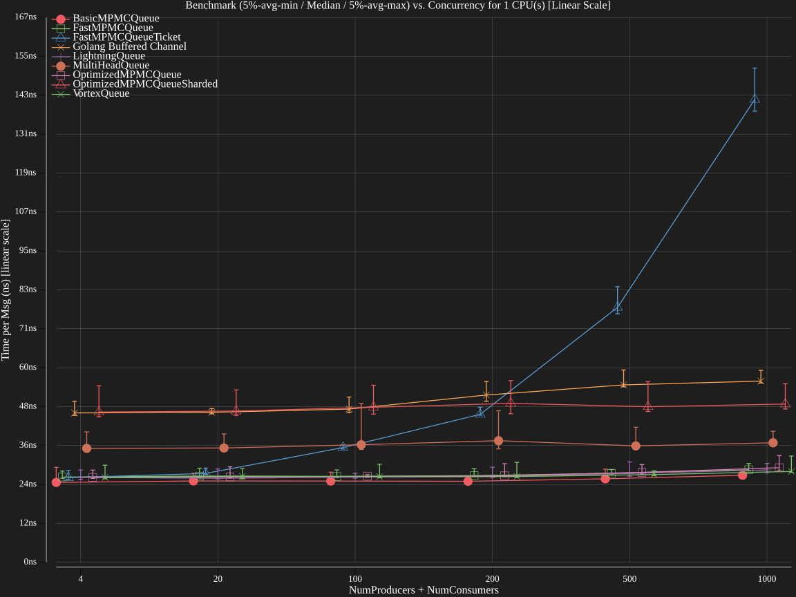
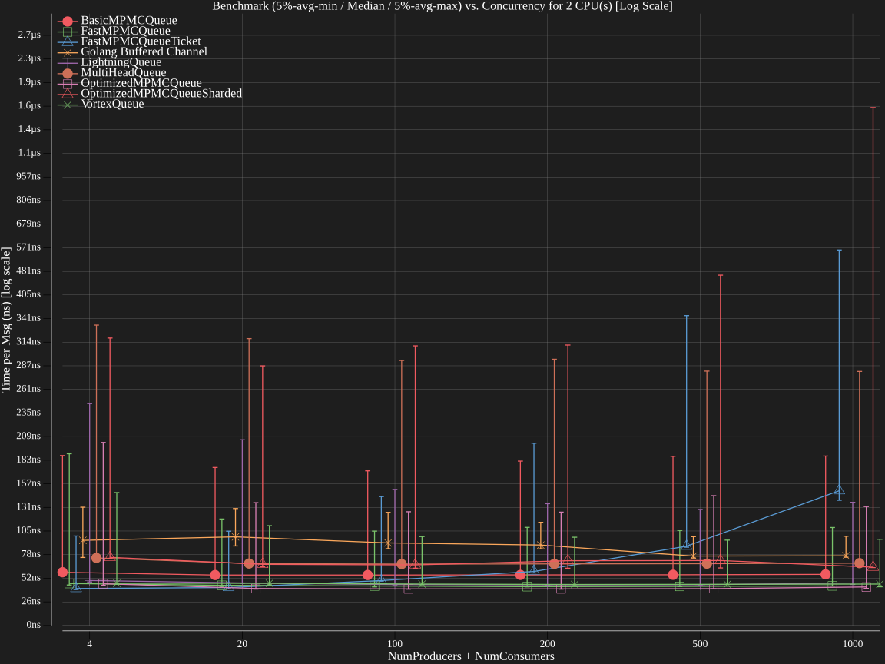
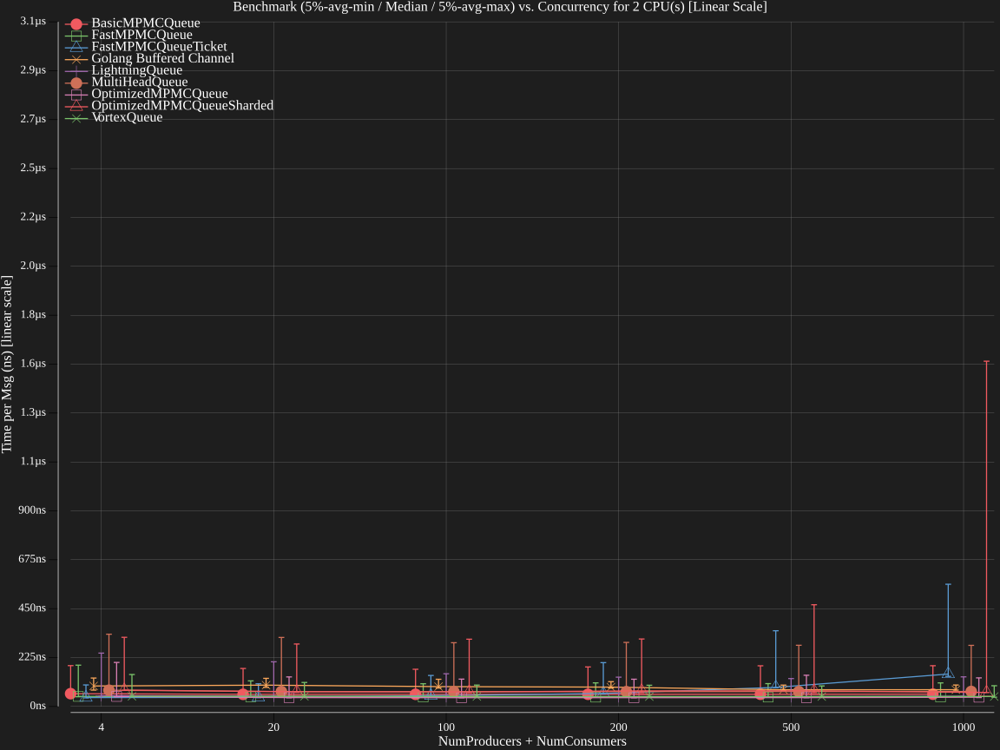
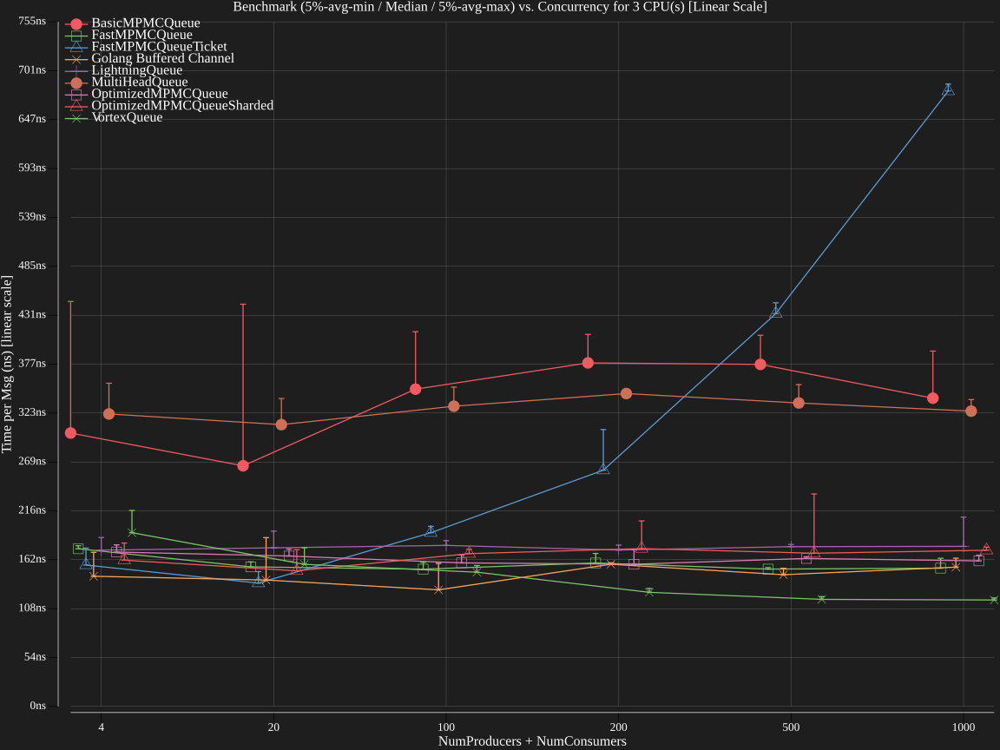
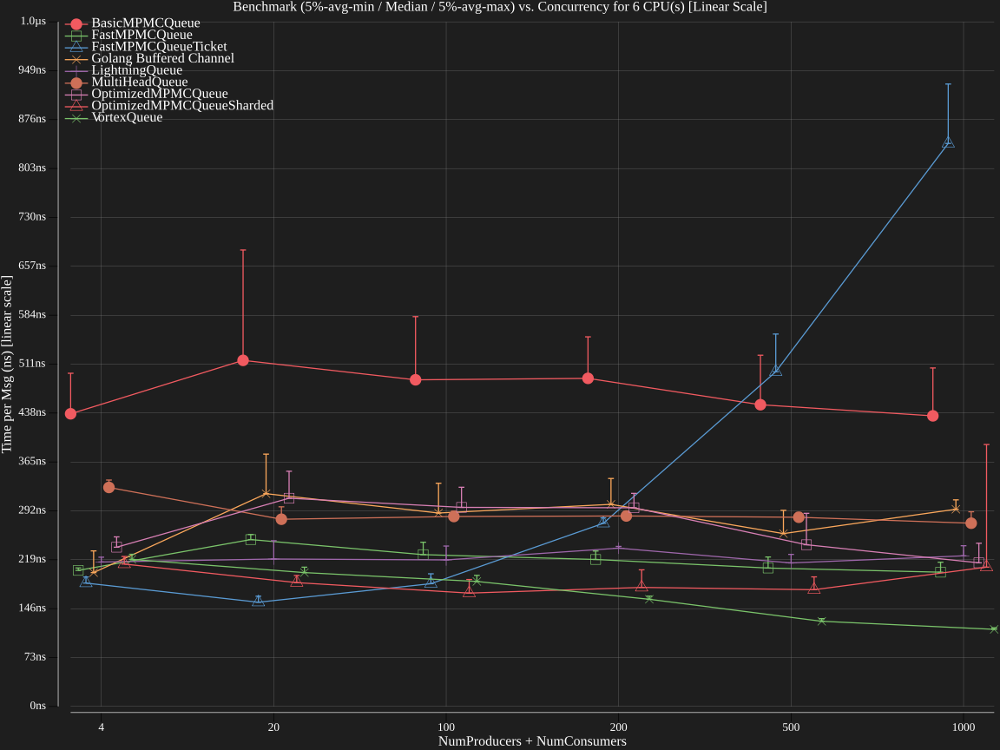
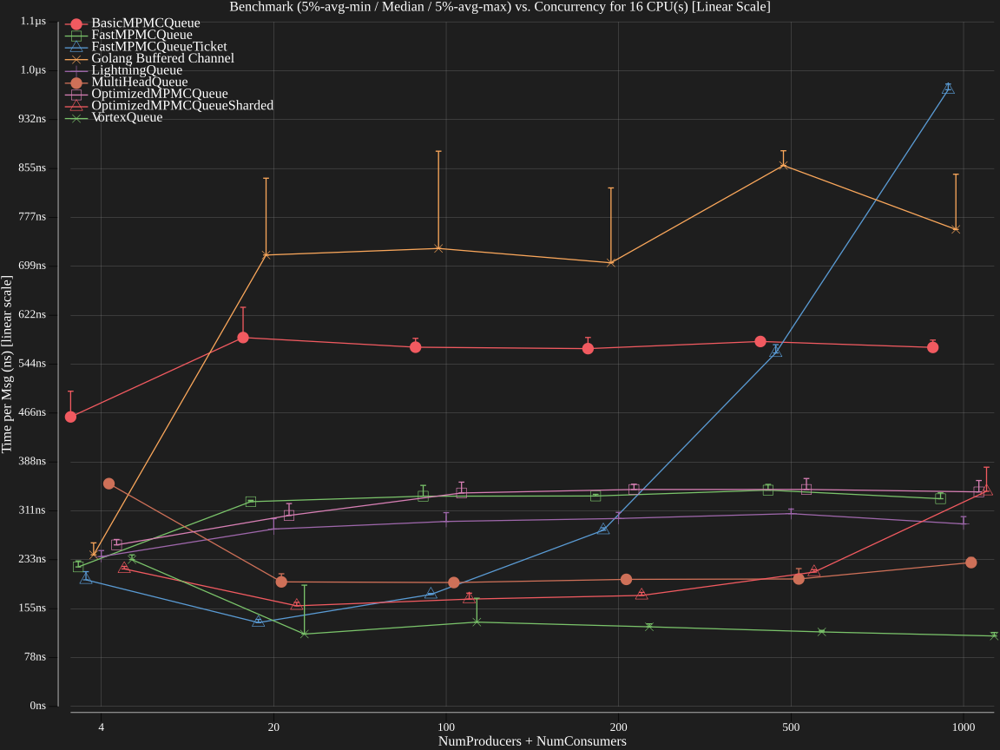

# GoQueueBench - Finding the Fastest Golang Queue

Welcome to **GoQueueBench**, a project dedicated to benchmarking and evaluating the fastest Golang queue implementations.

## Queue List

| Implementation            | Package         | Features                                       | Author                                                                                                    | Max Throughput (msgs/sec) |
| ------------------------- | --------------- | ---------------------------------------------- | --------------------------------------------------------------------------------------------------------- | ------------------------- |
| VortexQueue               | vortexqueue     | MPMC, FIFO, Cache-Optimized, Spin-Wait         | [Mia Heidenstedt](https://heidenstedt.org), OpenAI o3-mini-high[*](#why-are-there-llms-listed-as-authors) | 9545617                   |
| FastMPMCQueueTicket       | fastmpmc_ticket | MPMC, FIFO, Cache-Optimized, Ticket-Based      | [Mia Heidenstedt](https://heidenstedt.org), OpenAI o3-mini-high[*](#why-are-there-llms-listed-as-authors) | 8139560                   |
| MultiHeadQueue            | multiheadqueue  | MPMC, Multi-Head-FIFO, Sharded, Low Latency    | [Mia Heidenstedt](https://heidenstedt.org), OpenAI o3-mini-high[*](#why-are-there-llms-listed-as-authors) | 8046964                   |
| OptimizedMPMCQueueSharded | optmpmc_sharded | MPMC, Sharded, Multi-Head-FIFO                 | [Mia Heidenstedt](https://heidenstedt.org), OpenAI o1[*](#why-are-there-llms-listed-as-authors)           | 7552107                   |
| FastMPMCQueue             | fastmpmc        | MPMC, FIFO, Cache-Optimized                    | [Mia Heidenstedt](https://heidenstedt.org), OpenAI o3-mini-high[*](#why-are-there-llms-listed-as-authors) | 4322947                   |
| LightningQueue            | lightningqueue  | MPMC, FIFO, Cache-Optimized, Ultra-Low-Latency | [Mia Heidenstedt](https://heidenstedt.org), OpenAI o3-mini-high[*](#why-are-there-llms-listed-as-authors) | 4163510                   |
| Golang Buffered Channel   | buffered        | MPMC, FIFO                                     | [Mia Heidenstedt](https://heidenstedt.org)                                                                | 3859331                   |
| OptimizedMPMCQueue        | optmpmc         | MPMC, FIFO                                     | [Mia Heidenstedt](https://heidenstedt.org), OpenAI o1[*](#why-are-there-llms-listed-as-authors)           | 3852340                   |
| BasicMPMCQueue            | basicmpmc       | MPMC, FIFO                                     | [Mia Heidenstedt](https://heidenstedt.org), OpenAI o3-mini-high[*](#why-are-there-llms-listed-as-authors) | 2312063                   |

## Benchmark Summary

> I tried to to model the `Overall Score` in a way that penalizes unpredictability regarding core count and concurrency pressure.  
> Meaning: Queues must perform consistently across both low and high concurrency levels and both low and high core counts, otherwise they will be penalized in the `Overall Score`.  


## Overall Summary
| Implementation            | Overall Score | Throughput Light Load | Throughput Heavy Load | Throughput Average | Stability Ratio | Homogeneity Factor | Uncertainty | Total Tests |
| ------------------------- | ------------- | --------------------- | --------------------- | ------------------ | --------------- | ------------------ | ----------- | ----------- |
| Golang Buffered Channel   | **3935618**   | **3419731**           | **2033275**           | **2628701**        | 0.80            | 0.90               | 0.64        | 30          |
| BasicMPMCQueue            | 3313087       | 2321259               | 1702320               | 2029334            | 1.04            | 0.92               | 0.53        | 30          |
| LightningQueue            | 3267431       | 2167034               | 1661673               | 1950082            | 1.11            | 0.92               | 0.36        | 30          |
| FastMPMCQueue             | 3254965       | 2248608               | 1672539               | 1982959            | 1.05            | 0.92               | 0.53        | 30          |
| OptimizedMPMCQueue        | 3241335       | 2223818               | 1666234               | 1979894            | 1.06            | 0.92               | 0.55        | 30          |
| FastMPMCQueueTicket       | 3181357       | 2101754               | 1615630               | 1875886            | **1.11**        | **0.93**           | 0.36        | 30          |
| VortexQueue               | 3131815       | 2083351               | 1593692               | 1861802            | 1.10            | 0.92               | **0.35**    | 30          |
| OptimizedMPMCQueueSharded | 3008473       | 2023547               | 1541688               | 1819997            | 1.08            | 0.92               | 0.47        | 30          |
| TurboQueue                | 2720302       | 2122516               | 1402545               | 1707035            | 0.94            | 0.90               | 0.51        | 30          |

## Local Scores by Cores Group
| Implementation            | Score 1Cores | Score 2Cores | Score 3Cores | Score 4Cores | Score 6Cores | Score 8Cores | Score 12Cores | Score 16Cores | Score 18Cores | Score 20Cores |
| ------------------------- | ------------ | ------------ | ------------ | ------------ | ------------ | ------------ | ------------- | ------------- | ------------- | ------------- |
| BasicMPMCQueue            | 5472728      | **3948999**  | 3269530      | 2863302      | 1941060      | 1247529      | 1011019       | 927816        | 916411        | 953070        |
| FastMPMCQueue             | 5534342      | 3778455      | 3143204      | 2791705      | 1843993      | 1218182      | 1002357       | 925312        | 891069        | 949836        |
| FastMPMCQueueTicket       | 5172558      | 3726236      | 3072833      | 2709254      | 1879596      | 1177259      | 965273        | 884015        | 859036        | 812646        |
| Golang Buffered Channel   | 4149939      | 3569797      | **3444311**  | **3142204**  | **3084580**  | **1898086**  | **1659919**   | **1660972**   | **1412859**   | **1542866**   |
| LightningQueue            | **5675762**  | 3747468      | 3028896      | 2771603      | 1728218      | 1249698      | 1003640       | 921876        | 894467        | 841605        |
| OptimizedMPMCQueue        | 5512946      | 3750536      | 3168096      | 2696419      | 1832219      | 1198640      | 988461        | 909487        | 893721        | 954525        |
| OptimizedMPMCQueueSharded | 4484773      | 3193256      | 2796739      | 2476029      | 1673906      | 1150106      | 975634        | 897802        | 840116        | 908540        |
| TurboQueue                | 2138417      | 2703975      | 2607630      | 2747319      | 2068830      | 1262948      | 1048574       | 967125        | 885183        | 865242        |
| VortexQueue               | 4962710      | 3521269      | 2757193      | 2668379      | 1792131      | 1237757      | 1002036       | 898369        | 866451        | 819210        |

## Local Scores by Concurrency Group
| Implementation            | Score 4Conc | Score 20Conc | Score 100Conc |
| ------------------------- | ----------- | ------------ | ------------- |
| BasicMPMCQueue            | 2766263     | 2096593      | **2318046**   |
| FastMPMCQueue             | 2690067     | 2077718      | 2316177       |
| FastMPMCQueueTicket       | 2578650     | 1973549      | 2172336       |
| Golang Buffered Channel   | **3453327** | **2396910**  | 2067700       |
| LightningQueue            | 2722060     | 2094760      | 2312428       |
| OptimizedMPMCQueue        | 2680427     | 2075490      | 2297444       |
| OptimizedMPMCQueueSharded | 2357239     | 1864771      | 2034882       |
| TurboQueue                | 2165100     | 1375404      | 1519905       |
| VortexQueue               | 2541795     | 1907468      | 2133081       |

<details>
<summary><span style="font-weight:bold;"> 🚀 Click for the score formulas </span></summary>

-----

> I have put the analyze.py into GPT o3-min-high to have a quick explainer for the scores. It looks right but for the exact formula you should refer to the [analyze.py](./analyze.py) script that is used to calculate the scores. This explainer might be outdated.

### **Overall Score:**  
  The overall score is now computed as a weighted sum of three geometric means (baseline, worst-case, and average throughput) multiplied by a “ratio multiplier” (derived from the stability ratios) and further adjusted by a homogeneity factor (which replaces the old core consistency metric):

  $$
  \text{Overall Score} = \Bigl[0.5 \times \text{GeoMean(Baseline Throughput)} + 0.5 \times \text{GeoMean(Worst-case Throughput)} + 0.4 \times \text{GeoMean(Average Throughput)}\Bigr] \times \Bigl(0.5 + 1.1 \times \ln\Bigl(1 + (\text{Overall Stability Ratio})^{0.9}\Bigr)\Bigr) \times \text{Homogeneity Factor}
  $$

**Where:**
#### **GeoMean(Baseline Throughput):** 
The geometric mean of the baseline throughput values (i.e. the average throughput of the top 5% tests with the lowest total concurrency) across all cores groups.

#### **GeoMean(Worst-case Throughput):** 
The geometric mean of the worst-case throughput values (i.e. the average throughput of the bottom 5% tests with the lowest throughput) across all cores groups.

#### **GeoMean(Average Throughput):** 
The geometric mean of the average throughput (computed over all tests within each cores group).

#### **Overall Stability Ratio:** 
For each cores group the ratio is computed as  

$$
\text{Ratio} = \frac{\text{Worst-case Throughput}}{\text{Baseline Throughput}},
$$

and then these per-group ratios are combined in a harmonic-like fashion:

$$
\text{Overall Stability Ratio} = \frac{1.5 \times n}{\sum_{i=1}^{n} \frac{1}{(\text{Ratio})_i}},
$$

where \( n \) is the number of cores groups.

#### **Ratio Multiplier:** 
A logarithmic mapping to dampen the effect of the stability ratio:

$$
\text{Ratio Multiplier} = 0.5 + 1.1 \times \ln\Bigl(1 + (\text{Overall Stability Ratio})^{0.9}\Bigr)
$$

#### **Homogeneity Factor:** 
Instead of “Core Consistency”, the new version computes a homogeneity factor that measures the “wiggle” or variability in throughput across different total concurrency levels. It is defined as:

$$
\text{Homogeneity Factor} = \exp\Bigl(-\alpha \times \sum_{i}\Bigl|\ln\Bigl(\frac{T_{i+1}}{T_i}\Bigr)\Bigr|\Bigr)
$$

where `T_i` are the average throughput values at sequential concurrency levels and `alpha = 0.2`.

### **Local Score (per Cores Group):**  
  The local score now factors in a local homogeneity metric. For each cores group the local score is calculated as:

  $$
  \text{Local Score} = \sqrt{\text{Baseline Throughput} \times \text{Worst-case Throughput}} \times \text{Local Homogeneity Factor}
  $$

  **Where:**
  - **Baseline Throughput:** The average throughput of the top 5% tests (lowest total concurrency) for that cores group.
  - **Worst-case Throughput:** The average throughput of the bottom 5% tests (lowest throughput) for that cores group.
  - **Local Homogeneity Factor:** Computed similarly to the overall homogeneity factor but applied within each cores group individually.

-----

</details>  

<br />

| Cores    | Log Scale                                     | Linear scale                                            |
| -------- | --------------------------------------------- | ------------------------------------------------------- |
| 1 Cores  |   |   |
| 2 Cores  |   |   |
| 3 Cores  |   |   |
| 4 Cores  |   |   |
| 6 Cores  |   |   |
| 8 Cores  |   |   |
| 12 Cores |  |  |
| 16 Cores |  |  |
| 18 Cores |  |  |
| 20 Cores |  |  |


## Requirements & Design Philosophy

- The queues **only need to store pointers** (`T`) and are **not required** to support additional data structures or resizing.
- The focus is **raw performance** under **multi-producer multi-consumer (MPMC) loads** (although SPSC submissions are also welcome).
- Every queue implementation has to follow a **common interface**.

## Test Suite

This project includes an **extensive test suite** that ensures:

- Each queue implementation behaves correctly under various levels of load.
- Performance is measured using different producer/consumer configurations.
- Benchmarks are run multiple times to ensure consistent results.

## Security Considerations

I **have not** performed any in-depth security assessments. However:

- Since these queues **only store pointers**, the **attack surface is quite small**.
- No memory copying of stored data occurs within the queue itself.
- Users are still responsible for handling synchronization and preventing data races in their applications.

## Usage

The queues are available as individual Go packages. Each package provides its own optimized implementation but follows the same standard interface that does not have to be used to improve performance:

```go
package queue

// QueueValidationInterface is a *type constraint* that ensures any type Q has
// these methods. We never store Q in a runtime interface—
// we only use QueueValidationInterface at compile time to ensure matching signatures.
type QueueValidationInterface[T any] interface {
	// Enqueue adds an element to the queue and blocks if the queue is full.
	Enqueue(T)

	// Dequeue removes and returns the oldest element.
	// If the queue is empty (no element is available), it should return a empty T and false, otherwise true.
	Dequeue() (T, bool)

	// FreeSlots returns how many more elements can be enqueued before the queue is full.
	FreeSlots() uint64

	// UsedSlots returns how many elements are currently queued.
	UsedSlots() uint64
}

// Pointer is a constraint that ensures T is always a pointer type.
type Pointer[T any] interface {
	*T
}

// Compile-time enforcement that T must be a pointer.
func enforcePointer[T any, PT interface{ ~*T }](q QueueValidationInterface[PT]) {}

```


## Production-Ready Requirements for Queue Features

When adding a new queue implementation, please ensure that it meets the following requirements for the relevant features:

### 1. **MPMC (Multi-Producer, Multi-Consumer)**
- **Concurrency Safety:**  
  - The queue must safely support multiple goroutines enqueuing and dequeuing simultaneously without race conditions, deadlocks, or panics.
  - All concurrent operations must be correctly synchronized to prevent data corruption.
- **Item Integrity:**  
  - No items should be lost or duplicated.
  - Each item enqueued by any producer must eventually be dequeued by one (and only one) consumer.
  
### 2. **FIFO (First-In, First-Out)**
- **Order Preservation:**  
  - The queue must guarantee that items are dequeued in the exact order they were enqueued.
  - Even under concurrent operations, the relative order of items from the same producer should be maintained.
- **Consistency at Capacity Boundaries:**  
  - The implementation must correctly handle wrap-around conditions (i.e., when the queue reaches its capacity and then has space freed).
  - No reordering should occur during such transitions.

### 3. **Sharded**
- **Reduced Contention via Partitioning:**  
  - The queue should be partitioned into multiple shards, with each shard managing its subset of items.
  - Sharding should reduce contention among concurrent operations.
- **Intra-Shard Order:**  
  - Each shard must independently maintain FIFO order for its items.

### 4. **Multi-Head-FIFO**
- **Global Order Integrity:**  
  - The queue must support concurrent dequeue and enqueue operations from multiple "heads" while still preserving the FIFO order of each shard individually.
- **Head Transition:**  
  - The implementation must gracefully handle cases where one head becomes empty and another takes over, without reordering items.

## New Implementation Onboarding
Any new queue can be plugged in by adding an entry to `getImplementations()` in `cmd/bench/main.go`. The entry should look like this:

```go
		{
			name:        "BasicMPMCQueue",
			pkgName:     "basicmpmc",
			description: "A basic MPMC queue with no optimizations.",
			authors:     []string{"Mia Heidenstedt <heidenstedt.org>"},
			features:    []string{"MPMC", "FIFO"},
			newQueue: func(capacity uint64) interface {
				Enqueue(*int)
				Dequeue() (*int, bool)
				FreeSlots() uint64
				UsedSlots() uint64
			} {
				return basicmpmc.New[*int](capacity)
			},
		},
```
**No additional config** should be needed. The tests automatically pick it up and verify correctness and concurrency safety.


## Why are there LLMs listed as authors
The * does not give the LLM or the company that developed, trained or hosts them any authorship rights, there are there purely for reference.  
I experimented with a few LLMs to see if and how one could use them to quickly iterate on such very narrow and very well testable problem space like queue implementations.  
I found that LLMs like to cheat if one does not clearly state that this is not allowed by bypassing the test with code that targets parameters tests set.  
Also they like to use already existing methods in the repo which kinda defeats the purpose of a new implementation.  
Overall, I would say they are helpful in such cases, at least if a knowledgeable human is overseeing the process and gives hints into the right direction, otherwise they tend to give up to early.  
I might write an agent one day that can iterate by itself over a package with test and bench feedback to maybe arrive at such totally new ideas or complex systems, but for now I am happy with the results I got from them.

## License
GoQueueBench © 2025 Mia Heidenstedt and contributors   
SPDX-License-Identifier: AGPL-3.0  
